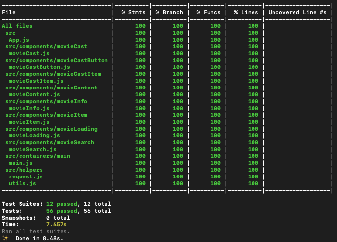

This project was bootstrapped with [Create React App](https://github.com/facebook/create-react-app).

## Frontend Technologies
* [React](https://reactjs.org/)
* [Ant Design](https://ant.design/docs/react/introduce)
* [Enzyme](https://airbnb.io/enzyme/)
* [Nock](https://github.com/nock/nock)

## Run App via Yarn
assuming the user has installed [yarn](https://yarnpkg.com/en/)
1. Clone this repository
2. execute `yarn` in root directory of repository
3. After installation of packages
  a. execute `yarn start`
  b. execute `yarn test --coverage`

## Test Coverage

## Web

## Tablet

## Mobile

